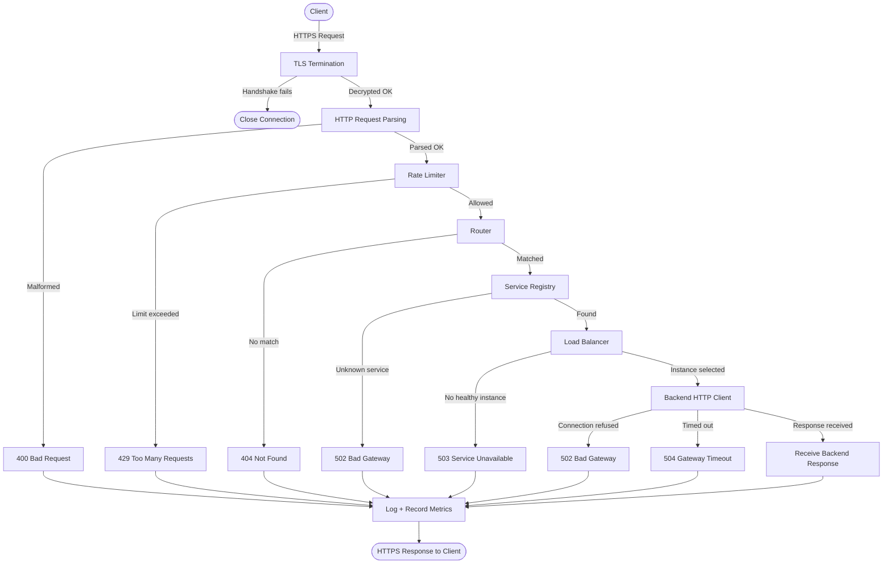

<p align="center">
  
  
  
  
  
</p>

<h1 align="center">⚡ API Gateway</h1>

<p align="center">
  <b>High-Performance C++ API Gateway — TLS-Terminating Reverse Proxy<br/>with Load Balancing, Rate Limiting, and Health-Aware Routing for Microservices</b>
</p>

<p align="center">
  <code>3,000 req/sec</code> → <code>16,000+ req/sec</code> — a 5× throughput gain through zero-allocation hot paths, connection pooling, and compiler optimization
</p>

---

## 🏗️ Architecture

```text
                        ┌─────────────────────────────────────┐
                        │           API Gateway (:8080)       │
                        │                                     │
  Clients ──HTTPS──►    │  TLS ► Parser ► Rate Limiter ►      │
                        │  Router ► Registry ► Load Balancer  │
                        │         ▼            ▼           ▼  │
                        │      Backend     Backend     Backend│
                        │      :9001       :9002       :9003  │
                        └─────────────────────────────────────┘
```

### Core Components

| Component | File | Responsibility |
|:--|:--|:--|
| **HTTP Connection** | `http_connection.cpp/hpp` | Accept clients, parse requests, keep-alive loop |
| **Router** | `router.cpp/hpp` | Match `method + path_prefix` → service name |
| **Service Registry** | `service_registry.cpp/hpp` | Map service names → backend instance lists |
| **Load Balancer** | `round_robin_balancer.cpp`, `least_connections_balancer.cpp` | Pick a healthy backend instance |
| **Connection Pool** | `connection_pool.cpp/hpp` | Reuse TCP sockets to backends (sharded, LIFO) |
| **Health Checker** | `health_checker.cpp/hpp` | Periodic probes, auto-drain dead backends |
| **HTTP Client** | `http_client.cpp/hpp` | Forward requests (warm path / cold path) |

---

## 🔄 Request / Response Flow



<details>
<summary>📝 Text-based flow (for terminals without Mermaid)</summary>

```text
Client
  │
  │ HTTPS Request
  ▼
┌───────────────────────────┐
│   TLS Termination (OpenSSL)│
└───────────────────────────┘
  │                      \
  │ handshake OK          \ handshake fails
  ▼                        ▼
HTTP Request Parsing     Close connection
  │                  \
  │ parses OK         \ malformed
  ▼                    ▼
Rate Limiter          400 Bad Request ──────────────────┐
  │              \                                      │
  │ allowed       \ exceeded                            │
  ▼                ▼                                    │
Router            429 Too Many Requests ────────────────┤
  │            \                                        │
  │ matched     \ no route                              │
  ▼              ▼                                      │
Registry        404 Not Found ──────────────────────────┤
  │          \                                          │
  │ found     \ unknown service                         │
  ▼            ▼                                        │
Balancer      502 Bad Gateway ──────────────────────────┤
  │        \                                            │
  │ selected\ no healthy instance                       │
  ▼          ▼                                          │
Backend     503 Service Unavailable ────────────────────┤
  │      \          \                                   │
  │ OK    \ refused  \ timeout                          │
  ▼        ▼          ▼                                 │
Response  502        504 ───────────────────────────────┤
  │                                                     │
  ▼                                                     │
Log + Metrics ◄─────────────────────────────────────────┘
  │
  ▼
HTTPS Response → Client
```

</details>

---

## 🚀 Performance Journey: 3k → 16k req/sec

### The Problem

The initial gateway worked correctly but was **architecturally slow** — every request triggered fresh TCP handshakes, heap allocations, and system calls.

### Phase 1 — Eliminating Waste (3k → 5k req/sec)

| Optimization | What It Fixed |
|:--|:--|
| **HTTP Keep-Alive** on client sockets | Stopped TCP teardown/reconnect per request |
| **Backend Connection Pool** (sharded, LIFO) | Reused TCP sockets to backends |
| **Warm-path forwarding** | Skipped DNS + TCP connect for pooled sockets |
| **`HttpClient` as member** (not per-request `shared_ptr`) | Eliminated 1 heap alloc per request |
| **Response by pointer** (not by value) | Eliminated body copy per request |
| **Precomputed `host_header`** | Eliminated 3 string allocs per request |
| **`Router::match()` → `const Route*`** | Eliminated 2 string allocs per match |
| **Cached client IP** in `start()` | Eliminated `getpeername()` syscall per request |
| **`TCP_NODELAY`** on all sockets | Removed 10ms Nagle buffering floor |
| **`net::strand`** in `HttpClient` | Fixed data races in multi-threaded `io_context` |

### Phase 2 — Compiler Unlocked (5k → 16k req/sec)

Switching from **Debug (`-O0`)** to **Release (`-O3`)** tripled throughput. Boost.Beast is a heavily-templated library — without inlining, every async completion chain was a deep stack of non-inlined calls.

### The Zero-Allocation Hot Path

On a steady-state keep-alive connection with a warmed pool, the entire request lifecycle performs **0 heap allocations**:

```text
async_read → Router::match (pointer) → Registry::find (pointer) → 
Balancer::select (atomic) → Pool::acquire (vector pop) → 
async_forward (pointer) → async_read (pointer) → async_write → 
Pool::release (vector push) → loop ♻️
```

### Benchmark Results

```
$ wrk -t4 -c50 -d10s http://127.0.0.1:8080/users

  Thread Stats   Avg      Stdev     Max   +/- Stdev
    Latency   415.82us  498.43us  12.06ms   89.37%
    Req/Sec     4.04k   428.62     5.69k    72.28%
  16,116 requests in 10.10s
  ────────────────────────────────────
  Requests/sec:  16,176.13
  Transfer/sec:   1.15MB
```

> **5× improvement** from the original 3k req/sec baseline — achieved without adding any external dependencies.

---

## 📦 Tech Stack

| Layer | Technology |
|:--|:--|
| Language | C++20 |
| Async I/O | Boost.Asio |
| HTTP | Boost.Beast |
| TLS | OpenSSL |
| Logging | spdlog |
| Config | yaml-cpp |
| Build | CMake 3.21+ |
| Package Manager | vcpkg |

---

## ⚙️ Setup & Build

### Prerequisites

- **C++20** compiler (GCC 11+ / Clang 14+)
- **CMake** ≥ 3.21
- **vcpkg** (for dependency management)

### 1. Clone & Bootstrap

```bash
git clone https://github.com/your-username/api-gateway.git
cd api-gateway

# Bootstrap vcpkg (if not already installed)
git clone https://github.com/microsoft/vcpkg.git
./vcpkg/bootstrap-vcpkg.sh
```

### 2. Build (Release)

```bash
cmake --preset default           # or: cmake -B build/ -DCMAKE_BUILD_TYPE=Release
cmake --build build/ -j$(nproc)
```

> ⚠️ **Always build in Release mode for benchmarking.** Debug builds disable Boost template inlining and run ~3× slower.

### 3. Configure

Edit `config/gateway.yaml` to define your services and routes:

```yaml
health_check:
  interval_ms: 5000
  timeout_ms: 1000
  unhealthy_after: 3
  healthy_after: 1

connection_pool:
  max_idle_per_backend: 1000
  idle_timeout_ms: 30000

services:
  user-service:
    load_balancing: round_robin
    instances:
      - host: 127.0.0.1
        port: 9001
      - host: 127.0.0.1
        port: 9002
      - host: 127.0.0.1
        port: 9003

routes:
  - path_prefix: /users
    method: GET
    service: user-service
```

### 4. Run

```bash
# Terminal 1 — Start mock backends
./build/mock_backend 9001 &
./build/mock_backend 9002 &
./build/mock_backend 9003 &

# Terminal 2 — Start the gateway
./build/api_gateway
```

---

## 🧪 Testing

### Smoke Test

```bash
curl http://127.0.0.1:8080/users
# Should return a response proxied from one of the backends
```

### Load Test with `wrk`

```bash
# Install wrk (Ubuntu/Debian)
sudo apt install wrk

# Run benchmark
wrk -t4 -c50 -d10s http://127.0.0.1:8080/users
```

### Health Check Verification

Kill one backend and observe the gateway automatically routes around it:

```bash
kill %2                          # Kill backend on :9002
# Gateway logs: "marked instance 127.0.0.1:9002 as unhealthy"
# Requests continue flowing to :9001 and :9003

./build/mock_backend 9002 &      # Bring it back
# Gateway logs: "marked instance 127.0.0.1:9002 as healthy"
```

---

## 📁 Project Structure

```
api-gateway/
├── config/
│   └── gateway.yaml              # Service routes & pool config
├── src/
│   ├── main.cpp                  # Entry point, thread pool, accept loop
│   ├── http_connection.cpp/hpp   # Client-facing connection & keep-alive
│   ├── http_client.cpp/hpp       # Backend forwarding (warm/cold paths)
│   ├── router.cpp/hpp            # Method + path → service matching
│   ├── service_registry.cpp/hpp  # Service name → instance list
│   ├── connection_pool.cpp/hpp   # Sharded backend socket pool (LIFO)
│   ├── health_checker.cpp/hpp    # Periodic probes + drain-on-fail
│   ├── round_robin_balancer.cpp  # Round-robin load balancing
│   ├── least_connections_balancer.cpp  # Least-connections balancing
│   ├── load_balancer.hpp         # Balancer interface
│   ├── backend_instance.hpp      # Instance model (host, port, id)
│   ├── connection_guard.hpp      # RAII active-connection counter
│   ├── route.hpp                 # Route model
│   └── service.hpp               # Service model
├── tools/
│   └── mock_backend.cpp          # Async mock HTTP server for testing
├── CMakeLists.txt
├── vcpkg.json
└── README.md
```

---

<p align="center">
  Built with 🔥 and C++20 — because sometimes you need raw performance.
</p>
